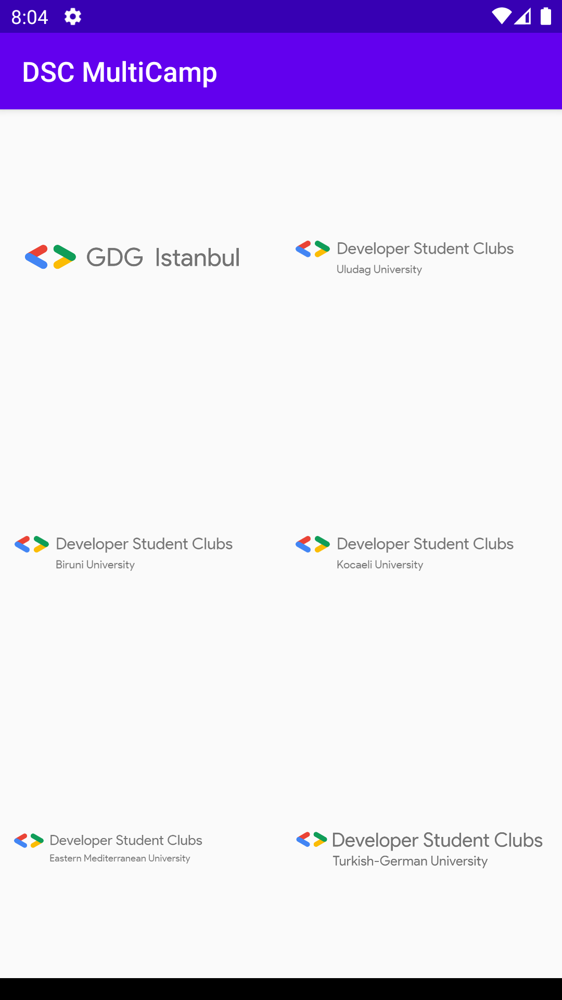
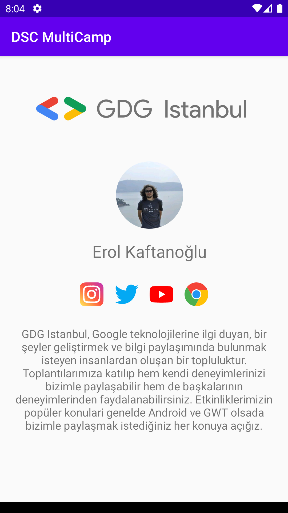

# DCS-MultiCamp Project

### APK
[

## Libraries 🛠
- [Kotlin](https://kotlinlang.org/) - First class and official programming language for Android development.
- [Coroutines](https://kotlinlang.org/docs/reference/coroutines-overview.html) - For asynchronous and more..
- [Android Architecture Components](https://developer.android.com/topic/libraries/architecture) - Collection of libraries that help you design robust, testable, and maintainable apps.
  - [LiveData](https://developer.android.com/topic/libraries/architecture/livedata) - Data objects that notify views when the underlying database changes.
  - [ViewModel](https://developer.android.com/topic/libraries/architecture/viewmodel) - Stores UI-related data that isn't destroyed on UI changes. 
  - [NavigationComponent](https://developer.android.com/guide/navigation/navigation-getting-started) - One Activity More Fragment.
- [Dagger - Hilt](https://dagger.dev/hilt/) - Dependency Injection Framework
- [Retrofit](https://square.github.io/retrofit/) - A type-safe HTTP client for Android and Java.
- [Glide](https://github.com/bumptech/glide) - Image loader library.

# Package Structure
    .
    .
    .
    ├── di                    # Dependency Injection 
    ├── model                 # Model classes
    ├── network               # For API Service.
    ├── ui                    # Activity
    |    ├── base           
    |    |    └──             # MainFragment, MainRepository, MainViewModel, CommunityAdapter
    |    └── splash
    |   
    └── BaseApplication.kt    # @HiltAndroidApp

<table style="width:100%">
  <tr>
    <th>Main Screen</th>
    <th>Detail Screen</th>
  </tr>
  <tr>
    <td></td>
    <td></td>
  </tr>
</table>
